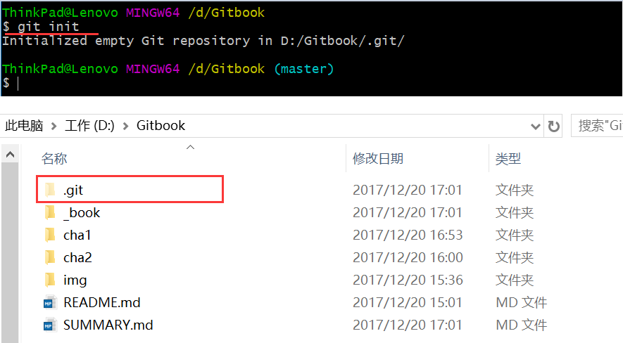

# 1.4 提交到github

### （1）初始化项目

在项目根目录，通过git init初始化项目，初始化成功会生成隐藏目录.git

### （2）添加到git版本控制

git add 文件：添加指定未加到版本控制

如果想添加所有，通过git add .

也可以通过下面命令

|   命令说明    | 新文件 | 修改的文件 | 删除文件 |   作用文件类型    |
| :---: | :---: | :---: | :---: | :--- |
| git add -A | √ | √ | √ | 新文件、修改、删除后的文件起作用 |
| git add . | √ | √ | √ | 同上 |

