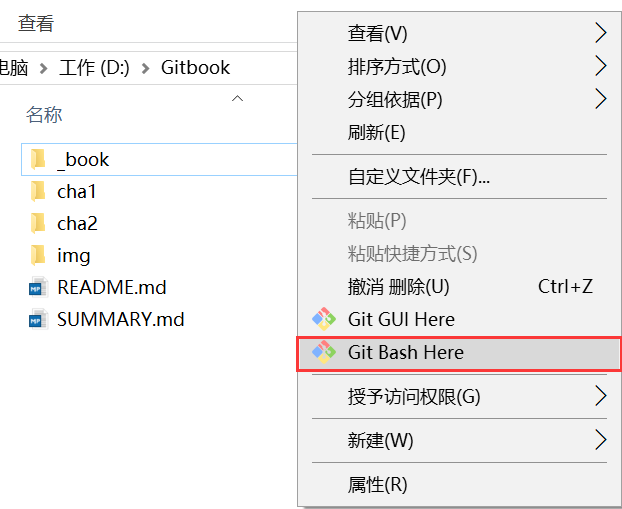
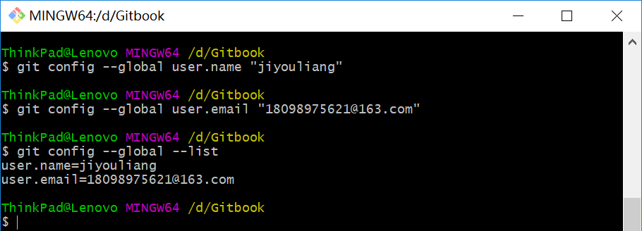
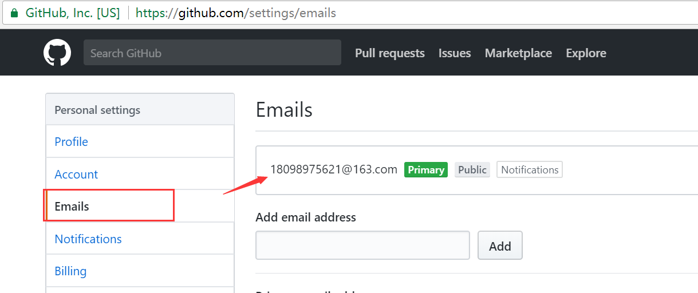

# 1.3初始化用户

如果已经配置过用户名、邮箱等信息，可以跳过本节

### 1.配置用户名/邮箱

**如果没有安装git，请参考第二节。**

在项目根目录 空白处右键 -> 打开Git Bash

	git config --global user.name "github账号"
	
	git config --global user.email "注册github使用的邮箱"

通过下面命令查看配置信息

 	git config --global --list

### 2.不知道邮箱？

通过github/setting查看自己邮箱信息

