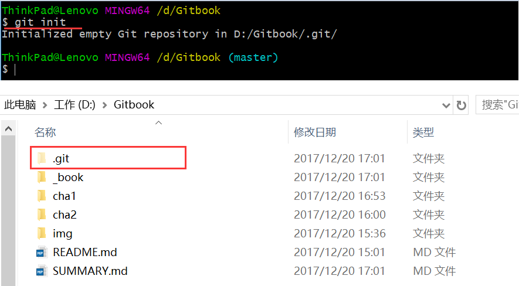
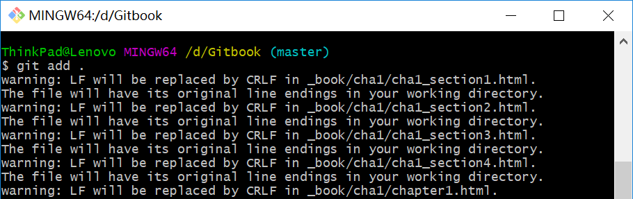
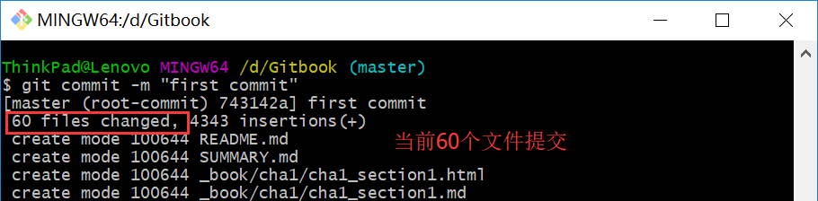
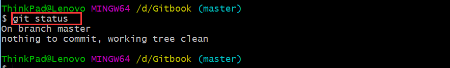
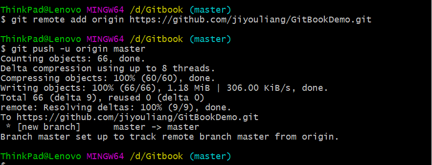
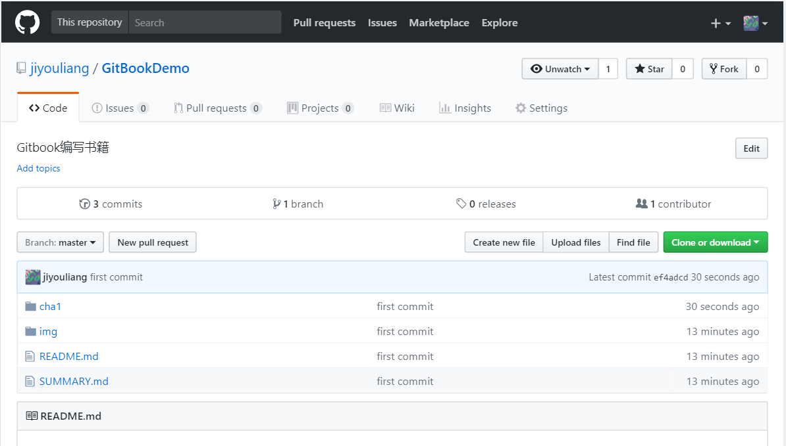

# 1.4 提交到github

### （1）初始化项目

在项目根目录，通过git init初始化项目，初始化成功会生成隐藏目录.git

### （2）添加到git版本控制

	git add 文件：添加指定未加到版本控制
	
	如果想添加所有，通过git add .
	

也可以通过下面命令:

|   命令说明    | 新文件 | 修改的文件 | 删除文件 |   作用文件类型    |
| :---: | :---: | :---: | :---: | :--- |
| git add -A | √ | √ | √ | 新文件、修改、删除后的文件起作用 |
| git add . | √ | √ | √ | 同上 |

### （3）提交到本地仓库

	git commit -m "注释"		//注释中英文均可

通过git status可以查看状态，如下表示提交成功。

### （4）提交到github

将本地仓库提交到github，github相当于git的服务器，作为远程仓库。

以后到公司中开发，就相当于提交到公司git服务器。

本地仓库关联远程仓库，该仓库是1.2节中创建的：

git remote add origin https://github.com/jiyouliang/GitBookDemo.git

提交到远程仓库（这里为github）：

git push -u origin master

第一次提交会提示输入github账号密码，提交成功如下：

刷新github项目，可以看到提交内容

